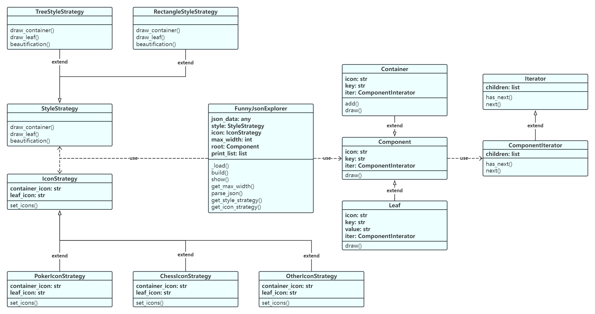
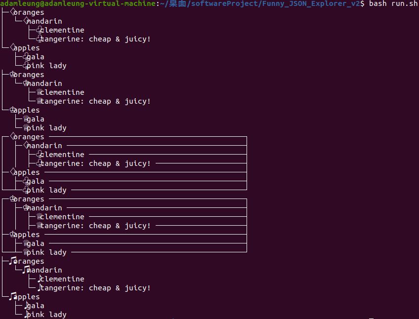

# Funny_JSON_Explorer_v2

Another version of command-line widget for JSON file visualization

在[旧版本](https://github.com/AdamLeung16/Funny_JSON_Explorer)基础上进行模式修改

Github代码仓库：[https://github.com/AdamLeung16/Funny_JSON_Explorer_v2](https://github.com/AdamLeung16/Funny_JSON_Explorer_v2)

### 一、设计文档

#### 1.1 类图



#### 1.2 说明

##### 1.2.1 迭代器

引入一个迭代器接口和具体的迭代器，用于遍历Component树结构。在FunnyJsonExplorer类的build方法中将json树的遍历方式修改成使用该迭代器，同理修改Component的draw方法。

**Iterator类**

* 功能：抽象迭代器接口，用于迭代器创建
* 成员变量：
  * children：当前迭代器的所有next迭代器对象列表
* 成员方法：
  * has_next()：判断是否存在next迭代器对象
  * next()：返回next迭代器对象

**ComponentIterator类**

* 功能：具体迭代器类，用于Component树结构的迭代
* 成员变量：
  * children：当前迭代器(父节点)的所有next迭代器对象(子节点)列表
* 成员方法：
  * has_next()：判断是否存在next迭代器对象(子节点)
  * next()：返回next迭代器对象(子节点)

##### 1.2.2 策略模式

对于style和icon分别定义两个抽象策略类StyleStrategy和IconStrategy，继承基类StyleStrategy实现具体style策略TreeStyleStrategy和RectangleStyleStrategy，继承基类IconStrategy实现具体icon策略PokerIconStrategy、ChessIconStrategy和OtherIconStrategy。

FunnyJsonExplorer类直接作为环境类，根据用户的输入选择调用对应的style策略和icon策略。

**StyleStrategy类**

* 功能：抽象策略基类，用于风格绘制
* 成员方法：
  * draw_container()：绘制中间节点
  * draw_leaf()：绘制叶节点
  * beautification()：微调美化

**IconStrategy类**

* 功能：抽象策略基类，用于图标族设置
* 成员变量：
  * container_icon：中间节点图标
  * leaf_icon：叶节点图标
* 成员方法：
  * set_icons()：设置图标族

**FunnyJsonExplorer类**

* 功能：解析json文件并在终端绘制成指定风格、图标族的可视化结构
* 修改的成员变量：
  * style：指定风格策略
  * icon：指定图标族策略
* 修改的成员方法：
  * get_style_strategy()：获取风格策略
  * get_icon_strategy()：获取图标族策略

### 二、运行截图

修改环境变量目录为当前src目录所在路径，运行与旧版本一致的测试shell脚本run.sh：

```shell
#!/bin/bash
export PATH="$PATH:/home/adamleung/桌面/softwareProject/Funny_JSON_Explorer_v2/src"
source ~/.bashrc
fje -f test/test.json -s tree -i poker
fje -f test/test.json -s tree -i chess
fje -f test/test.json -s rectangle -i poker
fje -f test/test.json -s rectangle -i chess
fje -f test/test.json -s tree -i music -c config/icon.json
```



### 三、扩展与维护

参考旧版本，改动不大。
